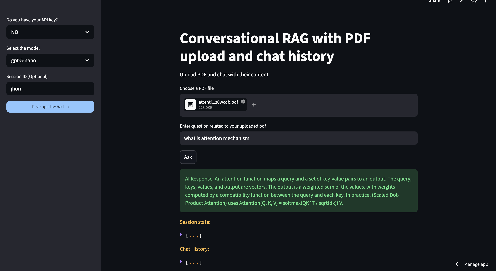

# 🤖 Conversational RAG with PDF Upload & Chat History

> Upload any PDF and have a context-aware conversation with its content — powered by LangChain, ChromaDB, and multiple LLM providers.

[](https://chat-with-pdf-rag-based.streamlit.app/)
[](https://python.org)
[](https://streamlit.io)
[](https://langchain.com)

---

## 📌 Overview

This is a **Retrieval-Augmented Generation (RAG)** web application that lets you upload one or more PDF files and interactively ask questions about their content. The app maintains full **chat history** across the conversation, so follow-up questions are understood in context — just like talking to a smart assistant who has read your document.

---

## ✨ Features

- 📄 **Multi-PDF Upload** — Upload and query multiple PDFs simultaneously
- 🧠 **Conversational Memory** — Chat history is preserved per session, enabling follow-up questions
- 🔄 **History-Aware Retrieval** — Reformulates ambiguous questions using chat history before retrieving context
- 🤖 **Multi-LLM Support** — Works with OpenAI, Google Gemini, and Groq (LLaMA) models
- 🔑 **Bring Your Own Key** — Use your own API key or fall back to the default OpenAI setup
- 🗄️ **ChromaDB Vector Store** — Fast, in-memory semantic search over your documents
- 🧹 **Auto Cleanup** — Automatically clears old embeddings when new files are uploaded
- 🎯 **Strict PDF-Only Answers** — The model answers *only* from your document; no hallucinations from general knowledge

---

## 🛠️ Tech Stack

| Layer | Technology |
|---|---|
| UI | [Streamlit](https://streamlit.io) |
| LLM Providers | OpenAI GPT, Google Gemini, Groq (LLaMA) |
| Embeddings | OpenAI `text-embedding-3-small` |
| RAG Framework | [LangChain](https://langchain.com) |
| Vector Store | [ChromaDB](https://www.trychroma.com) |
| PDF Loader | LangChain `PyPDFLoader` |
| Memory | `ChatMessageHistory` (per session) |

---

## 🚀 Getting Started

### 1. Clone the repository

```bash
git clone https://github.com/Rachin02/-Conversational-Q-A-chatbot-with-PDF
cd -Conversational-Q-A-chatbot-with-PDF
```

### 2. Create and activate a virtual environment

```bash
python -m venv venv
source venv/bin/activate        # macOS/Linux
venv\Scripts\activate           # Windows
```

### 3. Install dependencies

```bash
pip install -r requirements.txt
```

### 4. Set up environment variables

Create a `.env` file in the root directory:

```env
OPENAI_API_KEY=your_openai_api_key_here
```

> Other keys (Gemini, Groq) can be entered directly in the app sidebar at runtime.

### 5. Run the app

```bash
streamlit run app.py
```

---

## 🔑 Supported API Keys

| Prefix | Provider | Model Used |
|---|---|---|
| `sk-...` | OpenAI | `gpt-5-nano` |
| `gsk_...` | Groq | `llama-3.1-8b-instant` |
| `AI...` | Google Gemini | `gemini-2.0-flash` |

> If you don't have your own key, select **"NO"** in the sidebar to use the default OpenAI setup (requires a key in `.env`).

---

## 📁 Project Structure

```
├── app.py                  # Main Streamlit application
├── .env                    # Environment variables (not committed)
├── requirements.txt        # Python dependencies
├── temp.pdf                # Temporary PDF storage (auto-deleted)
├── chroma/                 # ChromaDB vector store (auto-managed)
└── README.md
```

---

## 💬 How It Works

```
User uploads PDF(s)
        ↓
Documents are chunked (5000 chars, 500 overlap)
        ↓
Chunks are embedded → stored in ChromaDB
        ↓
User asks a question
        ↓
History-aware retriever reformulates question using chat history
        ↓
Relevant chunks are retrieved from ChromaDB
        ↓
LLM answers using ONLY the retrieved context
        ↓
Answer + updated chat history displayed
```

---


## 📸 Screenshot
   
---

## ⚠️ Notes

- The app answers **strictly from your uploaded PDF**. If information is not in the document, it will explicitly say so.
- Uploading a new set of files clears all previous embeddings and chat history automatically.
- Session IDs let you maintain separate conversations in the same browser session.

---

## 🙋‍♂️ Author

**Rachin**

> Built with ❤️ using LangChain and Streamlit.
